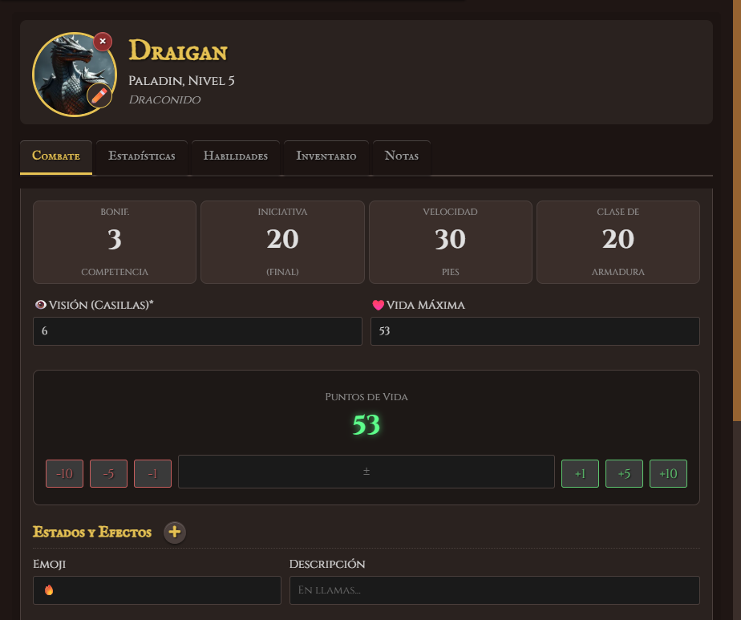
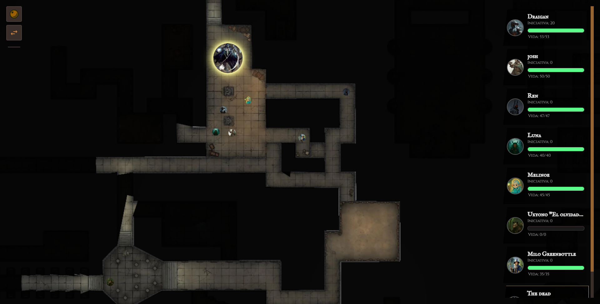
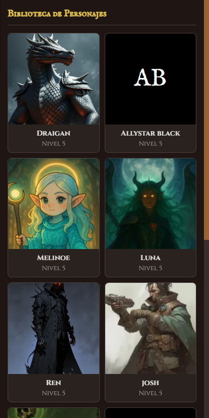
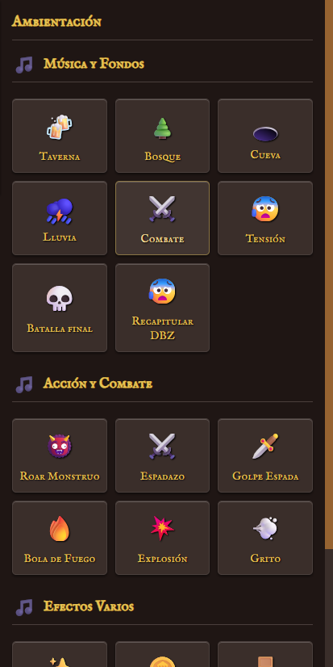

# 🔥 Master's Forge - Tu Arsenal Digital para el DM

<p align="center">  
  
</p>  

<p align="center">  
<strong>Herramientas ligeras y potentes para forjar tus aventuras de rol.</strong>  
</p>  

<p align="center">  
  
  
  
</p>  

---

**Master's Forge** es una aplicación web de tipo Virtual Tableto (VTT) diseñada desde cero con un enfoque minimalista y de alto rendimiento. Creada con **JavaScript puro, HTML y CSS**, esta herramienta ofrece al Dungeon Master un control total sobre la escena sin la sobrecarga de frameworks pesados.

## ✨ Características Principales

<table>  
<tr>  
<td valign="top" width="50%">  
<h3>🗺️ Gestión de Mapas y Escenas</h3>  
<ul>  
<li><strong>Visión Dinámica y Niebla de Guerra</strong>: Revela el mapa automáticamente según la visión de los jugadores.</li>  
<li><strong>Muros y Puertas Interactivas</strong>: Dibuja obstáculos que bloquean la visión y puertas que puedes abrir o cerrar.</li>  
<li><strong>Rejilla Personalizable</strong>: Control total sobre el tamaño, color, opacidad y alineación de la rejilla.</li>  
<li><strong>Pincel de Niebla</strong>: "Pinta" o "borra" manualmente áreas de niebla para efectos dramáticos.</li>  
<li><strong>Guardado de Escenas</strong>: Guarda y carga sesiones completas (mapa, fichas, muros, niebla) en tu navegador.</li>  
</ul>  
</td>  
<td valign="top" width="50%">  
<h3>🎲 Fichas y Personajes</h3>  
<ul>  
<li><strong>Editor de Fichas Completo</strong>: Gestiona estadísticas, vida, inventario, habilidades y notas para cada personaje.</li>  
<li><strong>Biblioteca de Personajes</strong>: Guarda tus creaciones para reutilizarlas fácilmente en cualquier campaña.</li>  
<li><strong>Tracker de Iniciativa</strong>: Un panel claro y conciso para la vista del jugador que se actualiza en tiempo real.</li>  
<li><strong>Importación y Exportación</strong>: Comparte tus escenas y bibliotecas con otros DMs mediante archivos <code>.json</code>.</li>  
<li><strong>Áreas de Efecto (AoE)</strong>: Previsualiza conos, esferas, cubos y más, originados desde una ficha.</li>  
</ul>  
</td>  
</tr>  
</table>  


  
<p align="center">La interfaz del DM, diseñada para tener todo a mano.</p>

---

## 🛠️ Stack Tecnológico

Este proyecto es un testimonio del poder de las tecnologías web fundamentales, sin depender de frameworks complejos.

- **Front-end**:
    
    
    
    
    
    
    
    (ES6+)
    
- **Almacenamiento Local**: IndexedDB para assets (imágenes, mapas) y LocalStorage para metadatos y configuraciones.
    
- **Comunicación en Tiempo Real**: BroadcastChannel API para una comunicación instantánea y eficiente entre la ventana del DM y la del Jugador.
    
- **Herramientas de IA y Diseño**: 
	- **Google AI Studio**: Utilizado para la generación de código, refactorización y resolución de problemas de lógica. 
	- **Microsoft Copilot Designer**: Empleado para la creación y conceptualización de los iconos e imágenes temáticas de la aplicación.
    

---

## 📸 Galería de Funcionalidades

<table>  
<tr>  
<td align="center">  
  
<br><em>Editor de fichas detallado con múltiples pestañas.</em>  
</td>  
<td align="center">  
  
<br><em>Visión dinámica en acción, con muros bloqueando la línea de visión.</em>  
</td>  
</tr>  
<tr>  
<td align="center">  
  
<br><em>Guarda y reutiliza personajes desde la biblioteca.</em>  
</td>  
<td align="center">  
  
<br><em>Panel de ambientación para añadir inmersión con música y efectos.</em>  
</td>  
</tr>  
</table>  

---

## 🚀 Cómo Empezar

1. **Clona el repositorio:**
    
    Generated bash
    
    ```
    git clone https://github.com/[tu-usuario]/[tu-repositorio].git
    ```
    
    Use code [with caution](https://support.google.com/legal/answer/13505487).Bash
    
2. **Navega a la carpeta:**
    
    Generated bash
    
    ```
    cd [tu-repositorio]
    ```
    
    Use code [with caution](https://support.google.com/legal/answer/13505487).Bash
    
3. **Abre los archivos en tu navegador:**
    
    - No necesitas un servidor local complejo. Simplemente abre index.html en tu navegador para la vista del DM.
        
    - Para la vista del jugador, abre player.html en una ventana o pestaña separada.
        
    
    > **Nota:** Para una experiencia óptima y para evitar problemas de CORS, se recomienda usar una extensión de servidor en vivo como **"Live Server"** para Visual Studio Code.
    

---

## 🗺️ Hoja de Ruta (Roadmap)

Aunque el proyecto es completamente funcional, aquí hay algunas ideas para futuras mejoras:

- Implementar un sistema de turnos más avanzado con rondas.
    
- Añadir soporte para dados 3D virtuales.
    
- Crear un bestiario pre-cargado con criaturas comunes.
    
- Permitir la personalización de temas y colores de la interfaz.
    
- Explorar la posibilidad de una conexión peer-to-peer con WebRTC para partidas online.
    

---

## 🤝 Contribuciones

¡Las contribuciones son bienvenidas! Si tienes ideas, sugerencias o quieres reportar un bug, por favor, abre un **Issue**. Si quieres contribuir con código, sigue estos pasos:

1. Haz un **Fork** del repositorio.
    
2. Crea una nueva rama (git checkout -b feature/tu-increible-feature).
    
3. Haz tus cambios y haz **Commit** (git commit -m 'Añade una nueva e increíble feature').
    
4. Haz **Push** a tu rama (git push origin feature/tu-increible-feature).
    
5. Abre un **Pull Request**.
    

---

## 👤 Sobre el Autor

Este proyecto fue creado con pasión por **Rafael Alvarez**.

- **Portafolio**: [...]
    
- **LinkedIn**: [...]
    
- **GitHub**: [[RafaelAlvarez29 (Rafael Alvarez)](https://github.com/RafaelAlvarez29)]
    

---

## 📜 Licencia

Este proyecto está bajo la Licencia MIT. Consulta el archivo LICENSE para más detalles.
